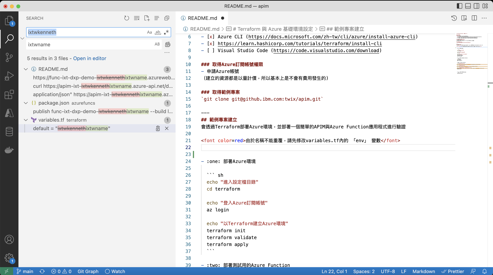

# Terraform 與 Azure 基礎環境設定

## 環境準備 
### 安裝工具
- [x] Linux、Mac 或 Windows的WSL環境 
- [x] Azure CLI (https://docs.microsoft.com/zh-tw/cli/azure/install-azure-cli)
- [x] https://learn.hashicorp.com/tutorials/terraform/install-cli
- [ ] Visual Studio Code (https://code.visualstudio.com/download)

### 取得Azure訂閱帳號權限
- 申請Azure帳號
（建立的資源都是以量計價，所以基本上是不會有費用發生的)

### 取得範例專案
`git clone git@github.ibm.com:twix/apim.git`

---
## 範例專案建立
透過Terraform部署Azure環境，並部署一個簡單的APIM與Azure Function應用程式進行驗證

<font color=red>也由於名稱不能重覆，所以可以參照下圖VSCode的方式找出所有ixtwkenneth，做一次性取代</font>


- :one: 部署Azure環境

  ``` sh
  echo "進入設定檔目錄"
  cd terraform

  echo "登入Azure訂閱帳號"
  az login 

  echo "以Terraform建立Azure環境"
  terraform init
  terraform validate
  terraform apply
  ```

- :two: 部署測試用的Azure Function
  ``` sh
  cd azurefuncs
  npm install
  npm run publish
  ```

- :three: 驗證Azure Function

  ``` sh
  echo "沒過APIM直接測API"
  curl https://func-ixt-dxp-demo-ixtwkenneth.azurewebsites.net/api/checkip
       
  echo "有過APIM直接測API"
  curl https://apim-ixt-ixtwkenneth.azure-api.net/demosvc/checkip
      
  echo "有過APIM直接測API (APIM直接回模擬資料)"
  curl -H "Content-Type: application/json" https://apim-ixt-ixtwkenneth.azure-api.net/demomock/mock

  ```


- :four: 移除已部署的Azure環境
  - 如果上述指含都正常，非常恭喜，你已完成本次Lab了，可以把環境留下來做各種測試，又或者透過以下指令刪除，
  
  - **注意**：APIM刪除後它會偷偷在背地裡留三天才會真的刪除，如果用同樣的名稱重建，就會收到名稱重覆或服務已存在的錯誤訊息。
  ``` sh
  terraform destroy
  ```

